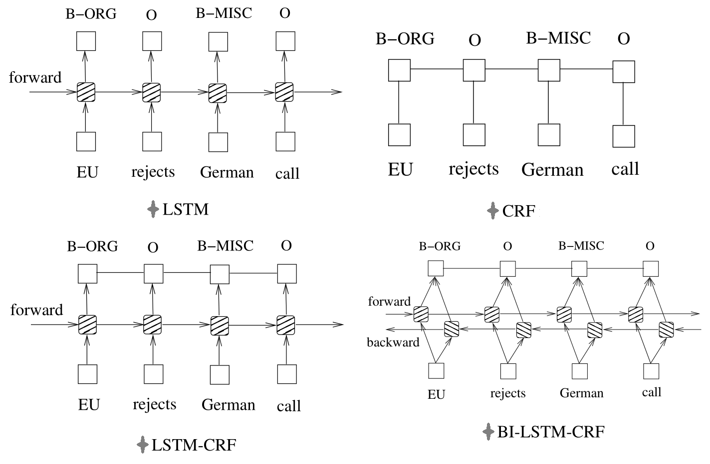

# sequence_labeling_nlp
基于统计方法（CRF/HMM）和神经网络方法的序列标注

## BiLSTM-CRF

### 文献
[Reading-Papers-Neural-Architecture-Sequence-Labeling](./paper)
  - Bidirectional LSTM-CRF models for sequence tagging_2015
  - Neural Architectures for Named Entity Recognition_2016
  - End-to-end Sequence Labeling via Bi-directional LSTM-CNNs-CRF_2016

### 理解模型
通过阅读上面提到的文献，了解了模型的结构，那么如何更深入的理解模型呢？
#### Q: BiLSTM-CRF为什么比单独BiLSTM、CRF的效果好，两者的作用分别是什么？
参考资料：
- [最通俗易懂的BiLSTM-CRF模型中的CRF层介绍](https://zhuanlan.zhihu.com/p/44042528)
- [简明条件随机场CRF介绍](https://zhuanlan.zhihu.com/p/37163081)
#### Q: CRF的理论和公式推导？

#### Q: 通过PyTorch官网代码教程理解模型
官方教程： [PyTorch-tutorial-BiLSTM-CRF](https://pytorch.org/tutorials/beginner/nlp/advanced_tutorial.html#sphx-glr-beginner-nlp-advanced-tutorial-py)  
已经下载到本地： [tutorial_pytorch_bilstm_crf](./tutorial_pytorch_bilstm_crf/)  
读代码：
- [Pytorch BiLSTM + CRF做NER](https://zhuanlan.zhihu.com/p/59845590)  
- [Pytorch Bi-LSTM + CRF 代码详解](https://blog.csdn.net/cuihuijun1hao/article/details/79405740)
